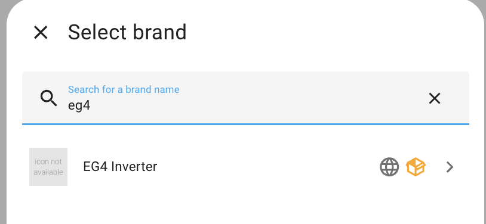
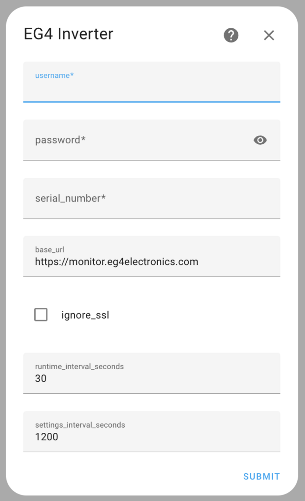
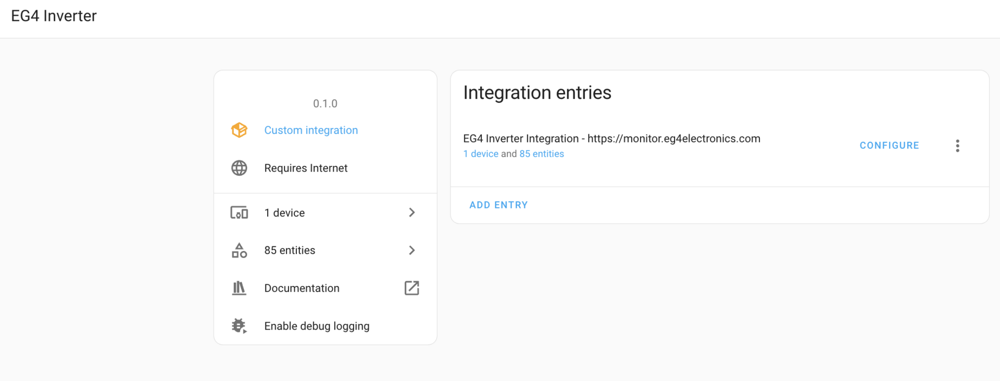
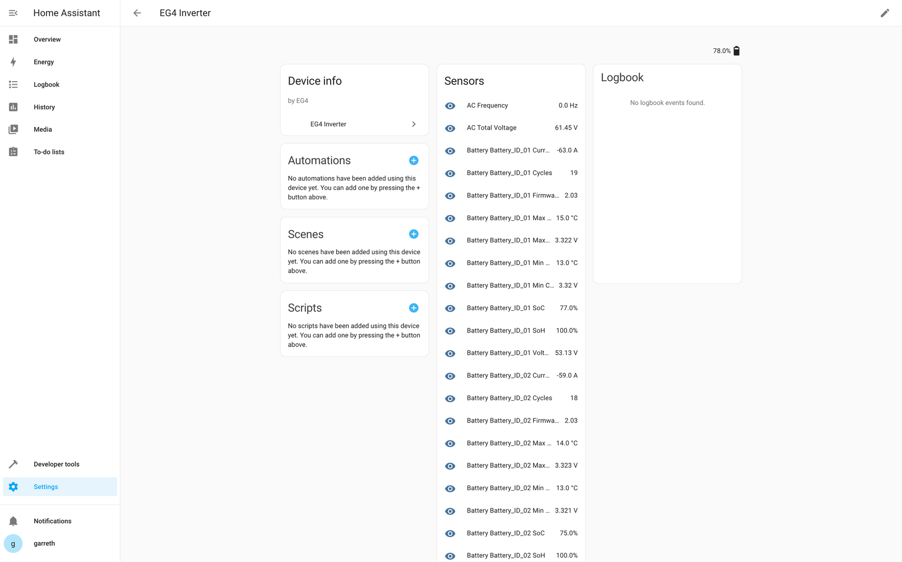
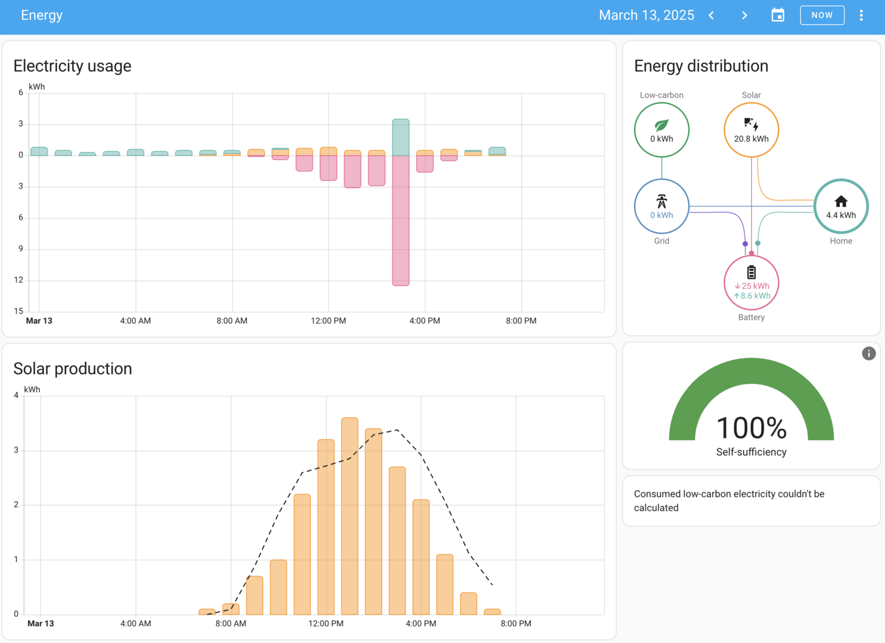

 

# Home Assistant EG4 Inverter Integration

This is a custom Home Assistant integration for monitoring EG4 inverter systems. It connects to the EG4 web portal to fetch real-time data about your solar system.

## Installation

- Click above to install as a custom repository via HACS
- Restart Home Assistant
- Once restart is done, use Add Integration -> EG4 Inverter.

## Features

- Retrieves status and production metrics from an EG4 Inverter.
- Allows you to expose the inverter’s data to Home Assistant sensors.
- Easy setup and configuration via UI.

  
  
  
  
  

## Multiple Inverters Support

This integration supports adding multiple EG4 Inverter devices to Home Assistant (e.g., “EG4 Inverter”, “EG4 Inverter 2”, “EG4 Inverter 3”, …)

Behavior:
- Each setup creates its own config entry and device in Home Assistant.
- The integration auto-assigns an index for each new entry:
  - The first (existing or first created) entry is index 1 and displays as “EG4 Inverter”.
  - Subsequent entries display as “EG4 Inverter {index}”.
- Entities keep their unique IDs based on the config entry ID, preserving history for existing users.
- Entity friendly names remain unchanged; use the device name to distinguish between inverters in the UI.

How to add multiple inverters:
1. Go to Settings → Devices & Services → Add Integration → “EG4 Inverter”.
2. Enter credentials and (optionally) serial number and other options as before.
3. Repeat the process to add a second or third inverter. The integration will automatically name them “EG4 Inverter 2”, “EG4 Inverter 3”, etc.

Migration for existing users:
- Existing installations are automatically migrated. The first entry is assigned index 1; device and entities remain intact.
- No manual steps are required.

Troubleshooting:
- If adding an additional inverter fails due to a duplicate error, update to the latest version and restart Home Assistant.
- Check Home Assistant logs for “EG4 Inverter” messages for details.

## Configuration

The integration requires your EG4 portal credentials:
- Username
- Password

## Contributors

- [Trixanna](https://github.com/Trixanna)
- 